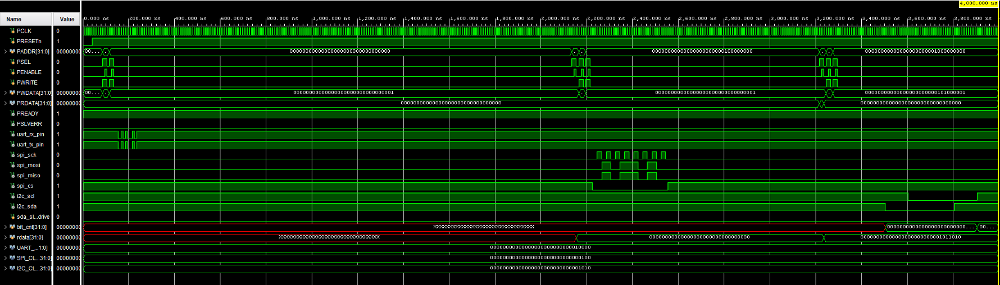

# 📡 Serial Communication IP Core Library (UART, SPI, I2C)

A modular, parameterized digital hardware IP library written in Verilog HDL. This repository provides foundational serial communication protocols designed for FPGA implementations, featuring standalone protocol controllers alongside standardized **APB3** slave wrappers for embedded SoC and processor integration.

---

## 📌 Architecture & Integration Layers

Each communication peripheral is structured in a two-layer modular architecture:

1. **Core Controller (Standalone):** Pure protocol engine managing serial timing, state machines, framing, and bit-level transmission.
2. **Bus Wrapper (APB3):** Memory-mapped slave interface enabling CPU/SoC register access via a unified 32-bit MMIO structure:
   * `0x00` - **CTRL_REG** : Core execution triggers and operation configuration.
   * `0x04` - **STATUS_REG**: Operational flags (`busy`, `done_tick`, error states).
   * `0x08` - **TX_DATA_REG**: Outgoing serial payload.
   * `0x0C` - **RX_DATA_REG**: Incoming received byte buffer.

---

## 🎛️ Unified APB3 Subsystem Integration

The repository features a centralized top-level controller (`apb_subsystem.v`) that aggregates all three peripheral IP cores under a single APB3 slave port with an integrated address decoder and return multiplexer.

### Subsystem Architecture

```text
                           +--------------------+
                           |    APB3 Master     |
                           +---------+----------+
                                     | (paddr, pwdata, pwrite, psel, penable)
                                     v
                           +--------------------+
                           |  Address Decoder   |
                           |   & Return Mux     |
                           +----+----+----+-----+
                                |    |    |
           +--------------------+    |    +--------------------+
           |                         |                         |
           v                         v                         v
  +------------------+      +------------------+      +------------------+
  |  APB UART Slave  |      |  APB SPI Master  |      |  APB I2C Master  |
  +--------+---------+      +--------+---------+      +--------+---------+
           |                         |                         |
        uart_tx                   spi_mosi                  i2c_sda
        uart_rx                   spi_miso                  i2c_scl
                                  spi_sclk
```

### System Memory Map

The subsystem decodes address lines (`paddr[11:0]`) to route bus transactions:

| Peripheral | Base Address | Address Range | Register Layout |
| :--- | :---: | :---: | :--- |
| **UART Core** | `0x000` | `0x000 - 0x0FF` | `0x00`: CTRL, `0x04`: STATUS, `0x08`: TX_DATA, `0x0C`: RX_DATA |
| **SPI Master** | `0x100` | `0x100 - 0x1FF` | `0x00`: CTRL, `0x04`: STATUS, `0x08`: TX_DATA, `0x0C`: RX_DATA |
| **I2C Master** | `0x200` | `0x200 - 0x2FF` | `0x00`: CTRL, `0x04`: STATUS, `0x08`: TX_DATA, `0x0C`: RX_DATA |

---

## 📊 FPGA Resource Utilization Summary

Benchmarks synthesized with **AMD Vivado ML v2024.2** targeting the **AMD Xilinx Artix-7 (XC7A35T-FTG256-1)** FPGA:

| Protocol | Top Module | Bus Interface | Slice LUTs | Slice Registers (FF) | CARRY4 | BRAM / DSP |
| :--- | :--- | :---: | :---: | :---: | :---: | :---: |
| **UART** | `apb_uart_slave` | APB3 | **58** *(0.28%)* | **53** *(0.13%)* | 4 | 0 / 0 |
| **SPI** | `apb_spi_slave` | APB3 | **34** *(0.16%)* | **46** *(0.11%)* | 0 | 0 / 0 |
| **I2C** | `apb_i2c_slave` | APB3 | **72** *(0.35%)* | **64** *(0.15%)* | 0 | 0 / 0 |

---

## 🔌 Protocol Implementations & Hardware Specifications

### 1. UART (Universal Asynchronous Receiver-Transmitter)
* **Protocol Overview:** Asynchronous, full-duplex serial link. Standard frame format: 1 Start bit (logic 0), 8 Data bits (LSB-first), 1 Stop bit (logic 1).
* **Hardware Architecture (`apb_uart_slave`):**
  * Independent TX and RX engines running off a parameterized clock divisor (`CLKS_PER_BIT = F_clk / Baud_rate`).
  * Midpoint oversampling logic on the RX path to reject clock drift and line noise.
  * Memory-mapped registers for direct polling-based transmission and reception.
* **Verification:** Loopback verified (`tx_pin` connected to `rx_pin`).

| Resource Type | Used | Total Available | Utilization (%) | Primitive Breakdown |
| :--- | :---: | :---: | :---: | :--- |
| **Slice LUTs** | **58** | 20,800 | 0.28% | 29 LUT6, 22 LUT5, 4 LUT4, 4 LUT3, 3 LUT2, 1 LUT1 |
| **Slice Registers** | **53** | 41,600 | 0.13% | 51 FDCE, 2 FDPE |
| **Arithmetic Carry (CARRY4)** | **4** | 8,150 | 0.05% | Hardware carry adders for baud counter |
| **BRAM / DSP** | **0** | - | 0.00% | Pure distributed logic |

---

### 2. SPI (Serial Peripheral Interface) Master
* **Protocol Overview:** Synchronous, four-wire, full-duplex communication bus utilizing `SCK`, `MOSI`, `MISO`, and active-low `CS`.
* **Hardware Architecture (`apb_spi_slave`):**
  * Operates in SPI Mode 0 (CPOL = 0, CPHA = 0): Data shifted out on falling edge, sampled on rising edge.
  * Dedicated serial clock scaler (`CLK_DIV`) deriving the SPI bus clock directly from system fabric.
  * Shift-register architecture performing simultaneous 8-bit bidirectional transfers.
  * Automated active-low Chip Select (`cs`) asserted on transaction triggers and de-asserted upon `done_tick`.
* **Verification:** Full-duplex loopback verified (`mosi` routed to `miso`).

| Resource Type | Used | Total Available | Utilization (%) | Primitive Breakdown |
| :--- | :---: | :---: | :---: | :--- |
| **Slice LUTs** | **34** | 20,800 | 0.16% | 14 LUT6, 10 LUT4, 6 LUT5, 5 LUT2, 3 LUT3, 1 LUT1 |
| **Slice Registers** | **46** | 41,600 | 0.11% | 41 FDCE, 5 FDPE |
| **Arithmetic Carry (CARRY4)** | **0** | 8,150 | 0.00% | Handled via slice LUT counters |
| **BRAM / DSP** | **0** | - | 0.00% | Pure distributed logic |

---

### 3. I2C (Inter-Integrated Circuit) Master
* **Protocol Overview:** Synchronous, bidirectional two-wire open-drain interface (`SCL` and `SDA`) requiring external pull-up resistors.
* **Hardware Architecture (`apb_i2c_slave`):**
  * FSM core generating compliant `START`, `STOP`, and `REPEATED START` bus states.
  * Standard 7-bit addressing with integrated Read/Write control bit steering.
  * Tri-state IO buffer management (`OBUFT`) for physical `sda` line driving and ACK/NACK status detection.
  * APB register mapping exposing target slave address, read/write direction, and error latching.
* **Verification:** Verified against an emulated I2C slave model asserting ACK phases on `sda`.

| Resource Type | Used | Total Available | Utilization (%) | Primitive Breakdown |
| :--- | :---: | :---: | :---: | :--- |
| **Slice LUTs** | **72** | 20,800 | 0.35% | 32 LUT6, 21 LUT5, 17 LUT4, 15 LUT3, 9 LUT2, 1 LUT1 |
| **Slice Registers** | **64** | 41,600 | 0.15% | 59 FDCE, 5 FDPE |
| **Tristate Buffers (OBUFT)** | **1** | - | - | Bidirectional `sda` open-drain emulation |
| **BRAM / DSP** | **0** | - | 0.00% | Pure distributed logic |

---

## 🧪 Simulation & Verification Flow

All testbenches are self-checking and leverage parameterized clock division for rapid RTL execution:

1. **Toolchain:** AMD Vivado Simulator (XSim).
2. **Speed Scaling:** Divide parameters (`CLKS_PER_BIT`, `CLK_DIV`) scale down during behavioral simulation, shrinking multi-millisecond bus waits into sub-microsecond assertion runs without changing RTL state machine logic.
3. **Subsystem Validation:** System-level verification is handled by `subsystem/tb/apb_subsystem_tb.v`, sequentially exercising all three protocols via APB transactions.



---

## 📁 Repository Organization

```text
├── uart/
│   ├── rtl/                    # uart_tx.v, uart_rx.v, apb_uart_slave.v
│   └── tb/                     # Unit testbenches
├── spi/
│   ├── rtl/                    # spi_master.v, apb_spi_slave.v
│   └── tb/                     # Unit testbenches
├── i2c/
│   ├── rtl/                    # i2c_master_rw.v, apb_i2c_slave.v
│   └── tb/                     # Unit testbenches
├── subsystem/
│   ├── rtl/                    # apb_subsystem.v (Top-level decoder & integration)
│   └── tb/                     # apb_subsystem_tb.v (System verification testbench)
├── ip_repo/
│   └── apb_subsystem/          # Packaged Vivado IP-XACT core (component.xml, xgui/)
├── docs/                       # Waveform screenshots and architecture assets
├── .gitignore
└── README.md
```

---

## 📦 Vivado IP Core Usage

1. In your target Vivado project, navigate to **Project Settings** $\rightarrow$ **IP** $\rightarrow$ **Repository**.
2. Click **`+`** and select the `ip_repo/apb_subsystem` directory.
3. Open your **Block Design**, right-click, select **Add IP**, and instantiate `apb_subsystem_v1_0`.
4. Connect the APB3 slave interface to your processor/DMA master and route external protocol pins to physical I/O constraints.