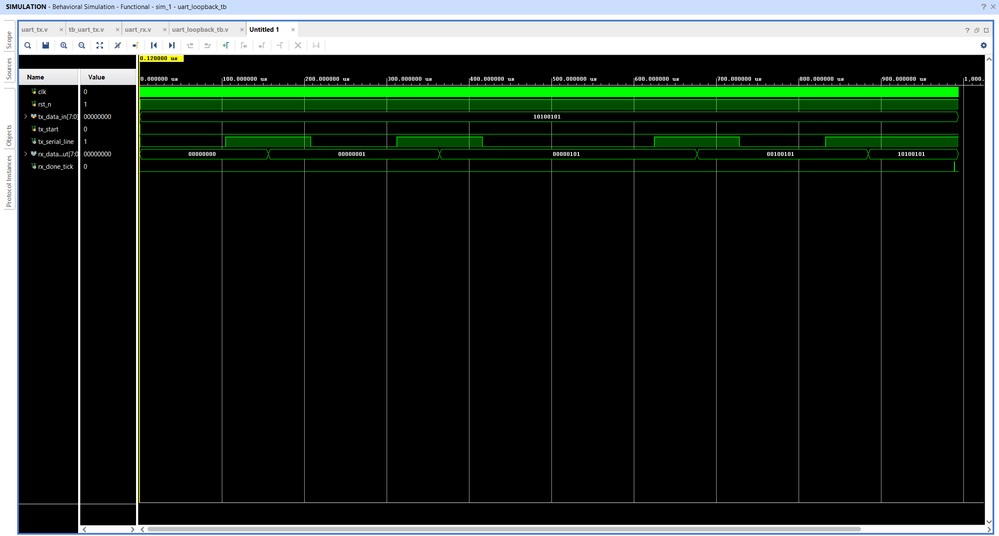

# Digital Communication Interfaces (RTL)

Synthesizable, modular, and parameterizable serial communication IP cores implemented in Verilog (IEEE 1364-2001) for FPGA and ASIC architectures.

## 📌 Features

### UART Core (`uart_tx.v` & `uart_rx.v`)
- **Frame Format:** 8-N-1 (1 Start bit, 8 Data bits, No parity, 1 Stop bit).
- **Timing:** Configurable clock-per-bit counter (default: 100 MHz clock, 9600 baud -> 10,400 clocks/bit).
- **Transmitter (TX):** FSM-driven serializer with deterministic transmission intervals.
- **Receiver (RX):** Mid-bit oversampling strategy with false-start glitch rejection.
- **Verification:** Self-checking loopback testbench verifying full TX-to-RX transmission.

---

## 🔬 Simulation & Verification

The loopback architecture connects `tx_pin` directly to `rx_pin`. Transmission of byte `0xA5` (binary: `10100101`) verified in AMD Xilinx Vivado ML.

---

## 📂 Repository Structure

- `UART/` : Core Verilog implementation and testbench (`uart_tx.v`, `uart_rx.v`, `uart_loopback_tb.v`).
- `/rtl/` : Synthesizable Verilog modules (`uart_tx.v`, `uart_rx.v`).
- `/tb/`  : Self-checking testbench environments (`uart_loopback_tb.v`).
